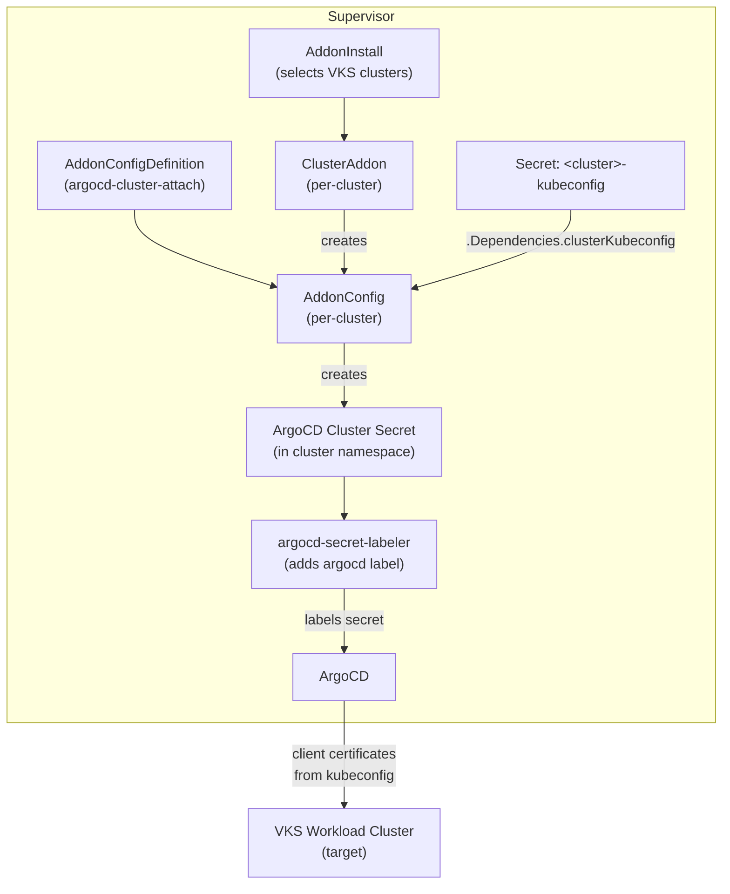

# ArgoCD Cluster Auto-Attach via Add-on Management System

Automatically register VKS workload clusters as ArgoCD target clusters using
the vSphere Supervisor Add-on Management System's `AddonConfigDefinition` (ACD)
process.

## Architecture



## How It Works

1. **AddonConfigDefinition** reads the VKS cluster's kubeconfig Secret from the
   Supervisor via `templateInputResources`, extracts the API server URL and CA
   certificate using `parseClusterInfo` / `getClusterServer`, and creates an
   ArgoCD-compatible cluster Secret in the cluster namespace.

2. **argocd-secret-labeler** (Deployment) polls for Secrets containing the
   `managed-by: argocd-cluster-attach` marker and adds the
   `argocd.argoproj.io/secret-type: cluster` label so ArgoCD discovers them.
   This is needed because `supervisorNamespaceOutput` does not support setting
   labels on the output resource.

## Files

| File | Description |
|------|-------------|
| `addonconfigdefinition.yaml` | ACD — extracts kubeconfig and creates ArgoCD cluster secret |
| `addon-and-release.yaml` | Addon and AddonRelease metadata |
| `addoninstall.yaml` | AddonInstall + example AddonConfig |
| `addonconfig-example.yaml` | Day0 AddonConfig template for per-cluster overrides |
| `argocd-secret-labeler.yaml` | Deployment that auto-labels secrets for ArgoCD discovery |
| `label-cluster-secret.sh` | Manual script for one-off secret labeling |

## Prerequisites

1. ArgoCD installed on the Supervisor (via ArgoCD Supervisor Service Operator)
2. VKS clusters provisioned with kubeconfig Secrets on the Supervisor

## Installation

### Step 1: Apply the ACD and addon metadata

```bash
kubectl apply -f addonconfigdefinition.yaml
kubectl apply -f addon-and-release.yaml
```

### Step 2: Deploy the secret labeler

The labeler runs as a lightweight Deployment and automatically labels secrets
created by the ACD so ArgoCD discovers them.

```bash
kubectl apply -f argocd-secret-labeler.yaml
```

### Step 3: Install the addon on target clusters

Edit `addoninstall.yaml` to select the desired namespace and clusters, then:

```bash
kubectl apply -f addoninstall.yaml
```

## Verification

```bash
# Check secret exists and has the label
kubectl get secret -n demo1 -l argocd.argoproj.io/secret-type=cluster

# Check secret content
kubectl get secret -n demo1 argocd-cluster-workload-vsphere-vks1 \
  -o jsonpath='{.data.server}' | base64 -d

# Check ArgoCD sees the cluster
argocd cluster list
```

## ACD Template Variables Reference

Discovered through testing on a live Supervisor:

| Variable | Type | Description |
|----------|------|-------------|
| `.Cluster.name` | string | VKS cluster name |
| `.Cluster.namespace` | string | Cluster namespace |
| `.Cluster.uid` | string | Cluster UID |
| `.Cluster.labels` | map | Cluster labels |
| `.Cluster.annotations` | map | Cluster annotations |
| `.Infrastructure` | string | Infrastructure provider (e.g. `vsphere`) |
| `.Values.<field>` | varies | User-provided values from AddonConfig |
| `.Dependencies.<inputName>` | map | Resources fetched via `templateInputResources` |

### Custom template functions

| Function | Input | Output |
|----------|-------|--------|
| `decodebase64` | base64 string | decoded string |
| `encodebase64` | string | base64 string |
| `parseClusterInfo` | kubeconfig YAML string | `*api.Cluster` object |
| `getClusterServer` | `*api.Cluster` object | server URL string |
| `parseAddressFromURL` | URL string | host/address string |
| `parsePortFromURL` | URL string | port string |
| `hasKey` | map, key string | bool |
| `toYaml` | object | YAML string |

### Known ACD limitations

- `supervisorNamespaceOutput` only supports `apiVersion`, `kind`, `name` — no
  `labels`, `metadata`, or `annotations`
- `targetClusterOutput` only supports `v1/Secret` resources
- `constraints` on `templateInputResources` only supports `optional` operator
- Template body cannot set `metadata.labels` — labels are silently dropped
- `getClusterServer` requires a `*api.Cluster` (from `parseClusterInfo`), not a string
- `CertificateAuthorityData` from `parseClusterInfo` is `[]byte` — use
  `printf "%s"` then `encodebase64` to get a base64 string
